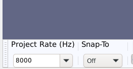
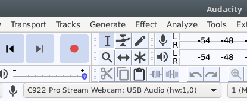
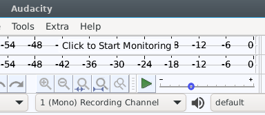
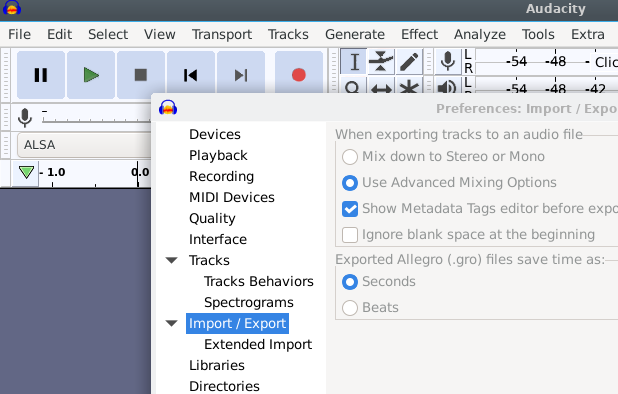
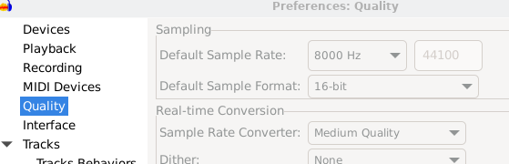
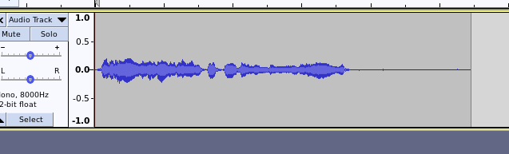
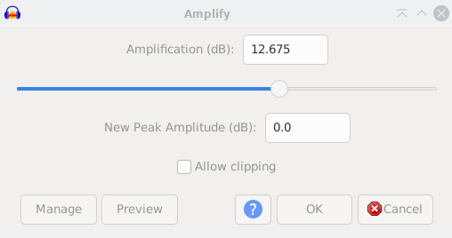
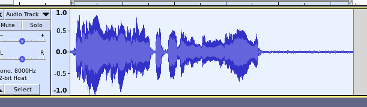
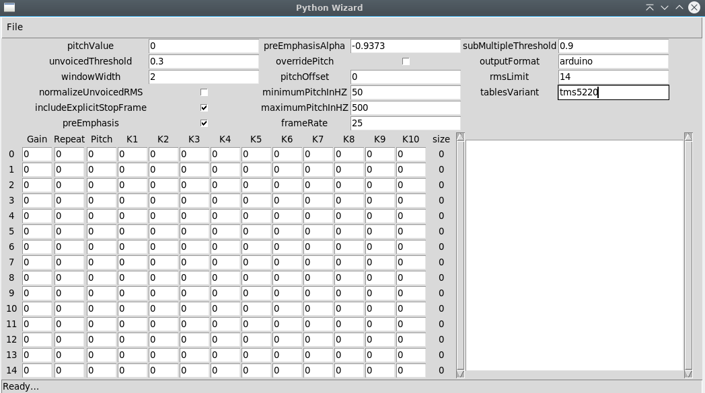
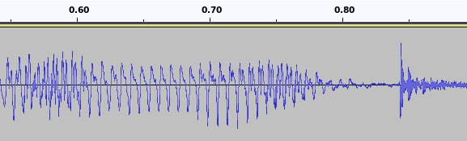

## How to make ESP32 talk with recorded voice (wav) files

### Table of contents

    - [ About the Arduino library Talkie ]
    - [ Hardware ]
    - [ Tools required for converting wav-files to LPC data ]
    - [ Audacity installation ]
    - [ Python language installation ]
    - [ python_wizzard installation ]
    - [ Git clone code repository ]
    - [ Voice recording with Audacity ]
    - [ Export the recording as a wav-file ]
    - [ Analyze your recording ]
    - [ Convert Wav file to LPC hex data ]
    - [ Install Arduino library Talkie ]
    - [ FAQ ]
    - [ References ]
  
### About the Arduino library Talkie

In the beginning, it was [Talkie](https://github.com/going-digital/Talkie/) by `Peter Knight`, a software implementation of the Texas Instruments speech synthesis architecture (Linear Predictive Coding) from the late 1970s to early 1980s. This library was later refined and improved over the years, and the refurbished [Talkie](https://github.com/ArminJo/Talkie/) is now maintained by `Armin Joachimsmeyer`.

Microcontrollers generally lack storage space for vast amounts of voice data. [LPC](https://en.wikipedia.org/wiki/Linear_predictive_coding) is a widely used method in speech coding and speech synthesis. It is a powerful speech analysis technique and a valuable way for encoding good-quality speech at a low bit rate resulting in a small size. 

YT `Gadget Reboot` and his episode [Arduino Speech Synthesizer: Talkie Library LPC Speech Generator](https://www.youtube.com/watch?v=O_yl5kcRO5w) is an excellent introduction to the speech subject. Add speech to the robotic device or other voice applications where slightly weird mechanical speech is wanted.

### Hardware

You only need an ESP32, an audio amplifier, and a small speaker element to start. The `Talkie library` has predefined **1200+** different sounds, words, and phrases ready to be used.
You can add new words or phrases by converting recorded `wav-files` and then encoding them to LPC data to be used in the ESP32 code. Purchase the [Arduino Talkie Speech Amplifier shield](https://github.com/berrak/Arduino-Talkie-Speech-Amplifier) for `ESP32 TinyPICO` at [Tindie](https://www.tindie.com/stores/debinix).


### Tools required for converting wav-files to LPC data

#### Audio processing

- Microphone, any decent microphone, or a webcam microphone. My Logitech Logi C922 worked fine.
- [Audacity](https://www.audacityteam.org) audio software. It Works for Windows, Linux, and macOS.
- The command line LPC analysis tool [python_wizard](https://github.com/ptwz/python_wizard) generates bitstreams for the Texas Instruments TMS5220 chip. It Works for Windows, Linux, and macOS.
  
An alternative to `python_wizzard` is [BlueWizzard](https://github.com/patrick99e99/BlueWizard) for macOS users. We will not cover it here, but [Gadget Reboot](https://www.youtube.com/watch?v=O_yl5kcRO5w) used it successfully.

#### Mediainfo to control the generated wav-files compatibility

- [MediaInfo](https://mediaarea.net/MediaInfoOnline) to test the `wav-file` for compatibility with LPC encoding.

#### Test assets

- Sample wav file 128kbs (8KHz, 16bit) - hello.waw
- Resulting LCS data                   - hellolpc.h

### Audacity installation

**Windows 10+ and macOS**

Follow the information on their [Download](https://www.audacityteam.org/download/) page. The plugin [FFmpeg for Windows](https://manual.audacityteam.org/man/installing_ffmpeg_for_windows.html) is required.

**Linux/Debian/Ubuntu**

Install via the package manager

```
sudo apt install audacity
```

### Python language installation

**Windows 10+**

`python_wizzard` is a CLI application that runs under Windows Linux Subsystem (WSL2).
Follow Microsoft's procedure to set up [WSL2](https://learn.microsoft.com/en-us/windows/wsl/install/).

Once `WSL2` is up and running, install `Python v3`, assuming the Linux distro is `Debian` or `Ubuntu`. The latter is MS default.
```
sudo apt install python3
```

**Linux/Debian/Ubuntu**

Most likely, `Python v3` is already installed. Test with:

```
~$ python3 --version
    Python 3.9.2
```

**macOS**

I have no access to macOS. Thus, it's left TBD until someone is kind and makes a PR.
Python v3 is likely already installed.


### python_wizzard installation

**Windows 10+**

The remaining Windows instructions (in the `WSL2` environment) follow the *Linux/Debian/Ubuntu* procedure.

**Linux/Debian/Ubuntu**

Install the remaining prerequisites for `python_wizzard`. First, install `git` and the `SciPy`, `python3-tk` libraries.

```
sudo apt install git python3-scipy python3-tk
```

**macOS**

I have no access to macOS. Thus, it's left TBD until someone is kind and makes a PR.


### Git clone code repository

Browse to GitHub and the [python_wizzard](https://github.com/ptwz/python_wizard) repository and copy the `clone link` under the green `Code` button.
Use `git` to clone a copy of the repository to a local directory.

```
git clone https://github.com/ptwz/python_wizard.git
``` 

### Voice recording with Audacity

Important to note that the resulting `wav-file` must be:

- Mono
- 8KHz sampling rate
- 16-bit encoded
- Constant bit rate

We will later verify all critical `wav-file` characteristics with `MediaInfo`. 

#### Start Audacity


*In the left lower corner at Project Rate (Hz), set it to 8000*
  

*Select the attached microphone in the drop-down list*



*Select `Mono` in the drop-down menu for the recording*

#### Set the preferences

Use menu `Edit -> Preferences ...`


*In Preferences:Export/Import, select Use Advance Mixing Options*


*In Preferences:Quality, select Default Sample Format 16-bit 
and check that Default Sample Rate is 8000 Hz*


#### Record your phrase or word


*A single soundtrack is displayed*


*Select the soundtrack with `Ctrl-A` and menu `Effect -> Amplify `...`, accept the proposed gain-value, and press OK*



*Adjusted sound level by accepting default gain*

### Export the recording as a wav-file

Export the recording with the menu `File -> Export -> Wav`.

One or two more dialogs may appear after this but continue with OK. 
Save your named file; here, we use `test.wav` as an example.


### Analyze your recording

Verify that the audio `wav-file` meets the requirements by uploading it to [MediaInfo](https://mediaarea.net/MediaInfoOnline).

Here is a good sample result.

```
General
Complete name                            : test.wav
Format                                   : Wave
File size                                : 85.5 KiB
Duration                                 : 5 s 468 ms
Overall bit rate mode                    : Constant
Overall bit rate                         : 128 kb/s

Audio
Format                                   : PCM
Format settings                          : Little / Signed
Codec ID                                 : 1
Duration                                 : 5 s 468 ms
Bit rate mode                            : Constant
Bit rate                                 : 128 kb/s
Channel(s)                               : 1 channel
Sampling rate                            : 8 000 Hz
Bit depth                                : 16 bits
Stream size                              : 85.4 KiB (100%)
```
Check that your file has the following characteristics.

- Overall bit rate mode = Constant
- Overall bit rate = 128 kB/s
- Format = PCM
- Format settings = Little / Signed
- Channel(s) = 1 channel
- Sampling rate  = 8 000 Hz
- Bit depth = 16 bits

There is no idea to continue until your `wav-file` has this correct.


### Convert Wav file to LPC hex data

Note: On *Windows 10+*, a practical challenge is to move the `wav-file` into the `WSL2 environment`. 
I'm not a regular `WSL2` user; thus, I rely on someone with experience who can suggest a solution (PR) to this issue.


Change to the downloaded `python_wizard` directory.

Copy the `wav-file` to this directory and run the command line application:

```
python3 python_wizard -S -T tms5220 -f arduino test.wav
```
or output its output to a file directly:
```
python3 python_wizard -S -T tms5220 -f arduino test.wav > testlpc.h
```
Then include the header file `testlpc.h` in the Arduino main sketch. See the directory `arduino/hello` directory for an example.

#### GUI python_wizzard_gui (do not use)

Start the application by typing at the terminal:

```
python3 python_wizzard_gui
```


However, it *may* work, or the **application may fail** with no code showing up in the output windows to the right.
The terminal shows `NameError: name 'CodingTable' is not defined` or some other error messages from an unresolved bug in the GUI application.

I can **not** recommend its usage, but it is included here for completeness.


### Install Arduino library Talkie

Browse to [Arduino IDE download page](https://www.arduino.cc/en/software) to install `Arduino IDE`.

Please, see the [Arduino library installation documentation](https://docs.arduino.cc/software/ide-v1/tutorials/installing-libraries) and how to install the Arduino library [Talkie](https://github.com/ArminJo/Talkie/).

### FAQ

**Q**: My overall bit rate is 256 kB/s. What should I do?
**A**: The wave file is not mono; thus, 2 x 8000 x 16 is 256 kB/s. Export the file as a mono (1 ch) file in Audacity. An alternative is to upload the `wav-file` to [Oline-convert](https://audio.online-convert.com/convert-to-wav) and only select the dropdown for `Change audio channels` and select `Mono`.

**Q**: I tried the `python_wizzard_gui`, but nothing happens when I load my `wav-file`; what to do?
**A**: Run the CLI instead with the parameters explained above.

**Q**: What cause the `python_wizzard_gui` error `NameError: name 'CodingTable' is not defined`?
**A**: A common cause is that the `wav-file` is not compliant as described above, or simply an unresolved bug in the application cause this error. Use the CLI application to resolve the issue.

**Q**: What Arduino-compatible boards do I need to try this practically?
**A**: A standard `Arduino UNO` board will do as a starter. These are available on `Amazon`. However, I would recommend an ESP32 with significantly more memory and WiFi capability for a real DIY project. Next, boost the audio output with the [Arduino Talkie Speech Amplifier](https://github.com/berrak/Arduino-Talkie-Speech-Amplifier). The shield sits on top of the `UM ESP32 TinyPICO`. Finally, add a small speaker to begin your new robotic project.

**Q**: My recording sounds full of clicks and pops when I play it with the `Talkie` library on my `Arduino Uno` board; why does the robotic voice sound like that?
**A**: Remember that synthesizing human voices is quite challenging. The vocal tract (the throat and mouth) forms the tube, characterized by its resonances; these resonances give rise to formants or enhanced frequency bands in the sound produced. Hisses and pops are generated by the tongue, lips, and throat action during sibilants and plosives. Human sounds dominantly produced in the mouth are complex and lacking resonances. For example, consider how the letter `x` in the word `hex` sounds. Compare this with the vocal sounds represented by `vowels` that are open and without friction.

**Q**: What can I do to improve my recorded words and phrases?
**A**: Analyze the recording already in `Audacity`, and decide if to use a `synonymous word` which may result in less noisy spikes. In articulatory phonetics, a `consonant` is a speech sound articulated with a complete or partial closure of the vocal tract. These are harder to LPC encode satisfactorily. Many tools are available in `Audacity` to mitigate the negative effect on sound quality.


*An example of a recorded voice sample with click/pop `noise` at the end.*


### References

- [Linear predictive coding](https://en.wikipedia.org/wiki/Linear_predictive_coding)
- [Vowel](https://en.wikipedia.org/wiki/Vowel)
- [Consonant](https://en.wikipedia.org/wiki/Consonant)
  